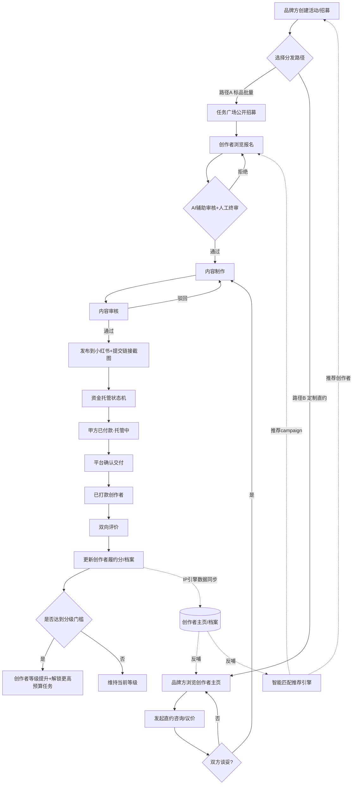

# C端创作者商业化模块 PRD（V0.1 讨论稿）

> 状态：讨论初稿，配合现有 B 端 UGC 平台（活动管理 / 任务广场 / 结算账单）一起阅读
> 设计参考：米画师（创作者主页 + 报价单 + 担保交易 + 分级接稿）、Boss直聘（先聊后定 + 双向匹配）
> 目的：把"内容增长闭环"（定位→选题→成稿→日历→数据→迭代）和"商业化闭环"（创作者-平台-甲方）打通

---

## 0. 背景与问题

现有 B 端架构已经跑通了"品牌方发活动 → 创作者报名 → AI 辅助审核 → 内容制作 → 内容审核 → 发布 → 线下结算"的标品流程，是一套完整的 campaign 管理系统。

但站在创作者侧看，目前角色是纯被动的：刷任务广场 → 报名 → 等审核 → 被分配 → 交付 → 结算。整个流程里，创作者过往的表现没有被持续记录和复用，每次报名都是从零开始被审核；品牌方也只能通过单次问卷判断创作者，决策成本高、信任成本高。

本 PRD 聚焦三件事：

1. 把创作者的历史表现（履约数据 + IP 引擎内容数据）变成一份持续累积、可被品牌方信任的"创作者档案"
2. 在现有"任务广场批量报名"之外，增加"创作者主页直约"这条更灵活的匹配路径
3. 引入分级解锁和资金托管状态，解决信任和激励问题

---

## 1. 设计参考与借鉴点

| 参考产品 | 借鉴的核心机制 | 对应到本项目 |
|---|---|---|
| 米画师 | 创作者主页：作品集 + 风格标签 + 报价单 + 完单数 + 好评率 | 创作者主页（功能 4） |
| 米画师 | 担保交易：甲方先付款托管，确认交付后才放款 | 资金托管状态机（功能 7） |
| 米画师 | 接稿状态/分级：完单量+好评率决定能接的单子档位 | 创作者分级与解锁（功能 8） |
| Boss直聘 | 先聊后定：双方先沟通细节、对齐预期，再正式建单 | 直约洽谈模块（功能 6） |
| Boss直聘 | 双向匹配推荐：不止甲方挑创作者，系统也主动推荐 | 智能匹配与推荐位（功能 9） |

---

## 2. 需求功能清单

| # | 功能模块 | 角色 | 功能说明 |
|---|---|---|---|
| 1 | 创作者主页 | 创作者 | 展示作品集（同步 IP 引擎历史爆文/选题数据）、垂直标签、粉丝画像、完单数、好评率；品牌方可直接访问 |
| 2 | 报价单管理 | 创作者 | 按内容类型（图文笔记 / 视频）设置报价；系统可基于历史表现给出建议报价区间，创作者可在区间内自行调整 |
| 3 | 创作者档案 / 履约分 | 系统 | 汇总每次合作的发布数据、品牌方评分、按时交付率，生成持续更新的"履约分"，独立于单次报名问卷 |
| 4 | 双通路任务分发 | 创作者 + 品牌方 | **路径A** 任务广场批量报名（沿用现有流程，适合标品/批量招募）；**路径B** 创作者主页直约（适合定制化、高价值合作） |
| 5 | 任务广场（沿用现状） | 创作者 + 品牌方 + AI | 维持现有：活动列表 → 报名 → AI辅助审核+人工终审 |
| 6 | 直约洽谈与议价 | 品牌方 + 创作者 | 品牌方在创作者主页发起咨询/私信，双方对齐合作细节和报价，确认后转入正式订单 |
| 7 | 资金托管状态机 | 平台运营 + 系统 | 即使线下转账，系统内记录三段状态：「甲方已付款待托管」→「平台确认交付」→「已打款创作者」，全程留痕，减少纠纷 |
| 8 | 创作者分级与解锁机制 | 系统 | 基于履约分/完单数设定等级（新人 / 进阶 / 资深）；等级决定可接任务的预算门槛、是否进入推荐位 |
| 9 | 智能匹配与推荐位 | 系统 | 基于创作者档案（IP引擎内容数据 + 履约数据）双向推荐：向品牌方推荐匹配创作者，向创作者推送匹配campaign |
| 10 | 双向评价系统 | 品牌方 + 创作者 | 订单完成后双方互评：创作者评价品牌方（履约速度/沟通体验），品牌方评价创作者（交付质量/配合度），沉淀进档案 |
| 11 | IP引擎数据接入接口 | 系统 | 同步定位标签、选题命中率、爆文表现等数据进创作者主页和履约分计算，避免重复建数据体系 |
| 12 | 创作者商业化看板 | 创作者 | 可视化展示当前履约分、等级、距下一等级所需条件、历史收入趋势，作为持续产出的激励抓手 |

> 功能 5（任务广场报名审核）按之前讨论维持现状，暂不重新设计，等用户量起来后再迭代匹配算法。

---

## 3. 业务流程图



---

## 4. 与现有系统的关系

```
IP引擎（内容闭环）          创作者商业化模块（新增）         UGC平台（B端，已有）
定位 → 选题 → 成稿            创作者主页 / 履约分              活动管理 / 任务广场
   → 日历 → 数据 → 迭代  ──→     报价单 / 分级               报名审核 / 内容制作
                                资金托管状态机                内容审核 / 结算账单
                                   ↓ 数据反哺 ↑
                              智能匹配与推荐引擎
```

核心逻辑：IP 引擎产生的内容数据是创作者商业化档案的"原材料"，不需要为商业化单独建一套评分体系；商业化模块产生的履约数据（完单、评价、收入）反过来也可以作为创作者"成长进度"的一部分展示在 IP 引擎的看板里，形成双向闭环。

---

## 5. 分阶段实施建议

### Phase 1（优先，不依赖用户体量）
- 创作者主页（功能1）
- 报价单管理（功能2）
- 创作者档案/履约分 —— 先用简单规则计算，不做复杂算法（功能3）
- 资金托管状态机 —— 哪怕线下转账，先把状态留痕做出来（功能7）

理由：这四项是 C 端商业化"看起来像一个正经市场"的门面，从第一个创作者、第一个甲方开始就用得上，不需要等数据量起来。

### Phase 2（用户量起来后）
- 直约洽谈与议价（功能6）
- 创作者分级与解锁机制（功能8）
- 双向评价系统（功能10）

### Phase 3（数据量足够支撑算法后）
- 智能匹配与推荐位（功能9）
- IP引擎数据接入接口的自动化、规则化（功能11，Phase1可先手动/半自动同步）
- 创作者商业化看板的趋势分析与预测（功能12进阶）

任务广场报名审核（功能5）维持现状，按原计划等用户量大了再重新设计匹配逻辑。

---

## 6. 待讨论问题

1. 资金托管状态机第一版要不要接真实支付网关，还是继续"线下转账+系统留痕"？
2. 报价单的"建议报价"算法，第一版用什么字段（粉丝数？历史平均互动率？)，还是先让创作者完全自主定价，后续再加建议？
3. 分级门槛（完单数/好评率具体数值）由谁定——运营手动设定初版规则，还是要留可配置后台？
4. 创作者主页是否对所有品牌方公开可见，还是需要先有过合作记录/平台审核才能展示完整档案？
5. IP引擎和商业化模块目前是两套系统，数据同步是做实时接口，还是先用定期批量同步过渡？
